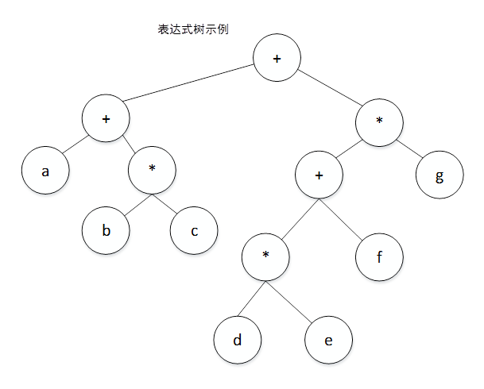

# 表达式树的建立和遍历

## 题目

### 【问题描述】
表达式树是二叉树的一种应用，叶子是操作数，其余结点为操作符。例如，下图表示的表达式树，用中序遍历得到中序表达式  $(a + b * c) + (d * e + f) * g)$



请编程实现表达式树的建立和遍历

### 【基本要求】
1. 表达式支持的运算符自行设定，例如，四则运算。
2. 采用某种方式输入表达式，例如后缀表达式形式。将用户输入的表达式创建成如上图所示的表达式树。
3. 遍历该表达式树，分别输出该表达式的中缀表达式和后缀表达式形式。


## 代码描述
实验代码使用C++写成。

本程序定义的运算规则除了四则运算：加（`+`），减（`-`），乘（`*`），除（`/`），还有整除（`//`），模除（`%`），乘方（`^`）运算，**不支持**单目的负数运算符。

程序解析步骤可用非左递归的BNF文法描述如下。

```BNF
<expr> ::= <term> <expr_tail>
<expr_tail> ::= + <term> <expr_tail>
              | - <term> <expr_tail>
              | <empty>

<term> ::= <power> <term_tail>
<term_tail> ::= * <power> <term_tail>
              | / <power> <term_tail>
              | % <power> <term_tail>
              | // <power> <term_tail>
              | <empty>

<power> ::= <factor> <power_tail>
<power_tail> ::= ^ <factor> <power_tail>
               | <empty>

<factor> ::= ( <expr> )
           | Num
           | Symbol
```


## 编译方法
在当前目录下执行

```bash
$ make
```
编译完成后将在`bin`子目录下生成可执行文件`expr_analysis`。

## 运行方式
在命令行下输入`expr_analysis`，程序会打印提示符`--> `在提示符后输入待解析的表达式（中缀形式），程序会解析并生成表达式树，在接下来的两行分别以中缀形式和后缀形式输出该表达式树。解析失败时会输出错误提示。输入`quit`结束程序运行。示例：
```bash
$ ./bin/expr_analysis
--> 32
32
32
--> 3*(4+5)+7^8
3*(4+5)+7^8
3 4 5 + * 7 8 ^ +
--> a*(b+c)+d^e
a*(b+c)+d^e
a b c + * d e ^ +
--> 32+65*
src/parser.cpp:92: unexpect token near position 6
--> 10_000*6.5
unknown character '_' on 3
--> 100$+100$
unknown character '$' on 4
--> quit
quit.
```

## 致谢

本程序中词法解析器和语法解析器的构建主要参考了这一系列的博文：[手把手教你构建 C 语言编译器](https://lotabout.me/2015/write-a-C-interpreter-0/)，在此对文章作者[lotabout](https://lotabout.me/)表示感谢。

## todo
- [ ] 符合华为格式规范
- [x] 解决`throw`时的内存泄漏
